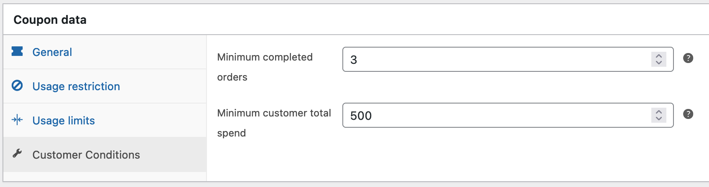
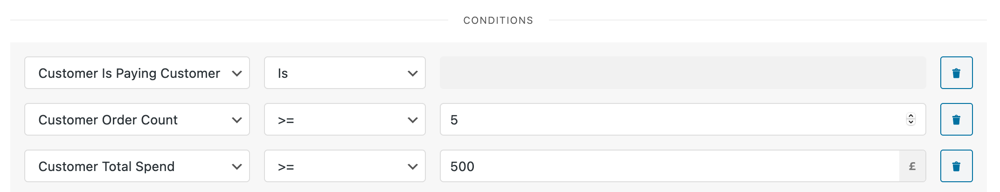

 

# Customer Conditions for WooCommerce

Adds conditions to coupons and to [WooCommerce Conditional Shipping and Payments](https://woocommerce.com/products/conditional-shipping-and-payments/).

Enables using WC_Customer properties 
* is_paying_customer()
* get_order_count()
* get_total_spend() 

e.g. restrict coupons to customers who have at least three orders and have already spent over $500.

e.g. allow Venmo payments for customers with over 5 orders and £500 already spent in the store.

## TODO

* Arbitrary meta key + regex.
* Investigate integration with: [WC Map Guest Orders and Downloads](https://wordpress.org/plugins/wc-map-guest-orders-and-downloads/)
* Investigate integration with: [pmgarman/wc-customer-order-index](https://github.com/pmgarman/wc-customer-order-index)
